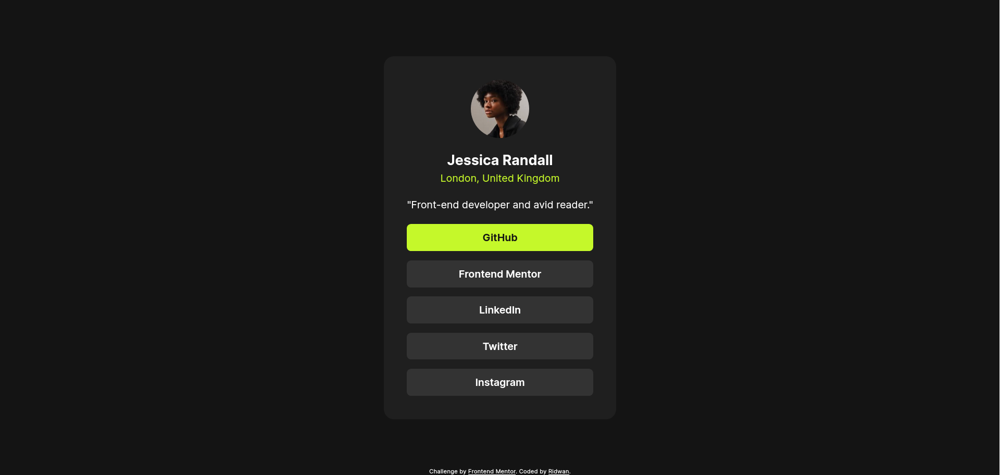

# Frontend Mentor - Social links profile solution

This is a solution to the [Social links profile challenge on Frontend Mentor](https://www.frontendmentor.io/challenges/social-links-profile-UG32l9m6dQ). Frontend Mentor challenges help you improve your coding skills by building realistic projects.

## Table of contents

- [Overview](#overview)
  - [The challenge](#the-challenge)
  - [Screenshot](#screenshot)
  - [Links](#links)
- [My process](#my-process)
  - [Built with](#built-with)
- [Author](#author)

## Overview

### The challenge

Users should be able to:

- See hover and focus states for all interactive elements on the page

### Screenshot

### Links

- Live Site URL: [https://social-links-profile-puce-rho.vercel.app/](https://social-links-profile-puce-rho.vercel.app/)

## My process

### Built with

- HTML5
- CSS3
- Flexbox
- [Inter](https://fonts.google.com/specimen/Inter) - Font
- BEM naming convention
- Design token system

## Author

- Frontend Mentor - [@ridwanpr](https://www.frontendmentor.io/profile/ridwanpr)
- Github - [@ridwanpr](https://github.com/ridwanpr)
